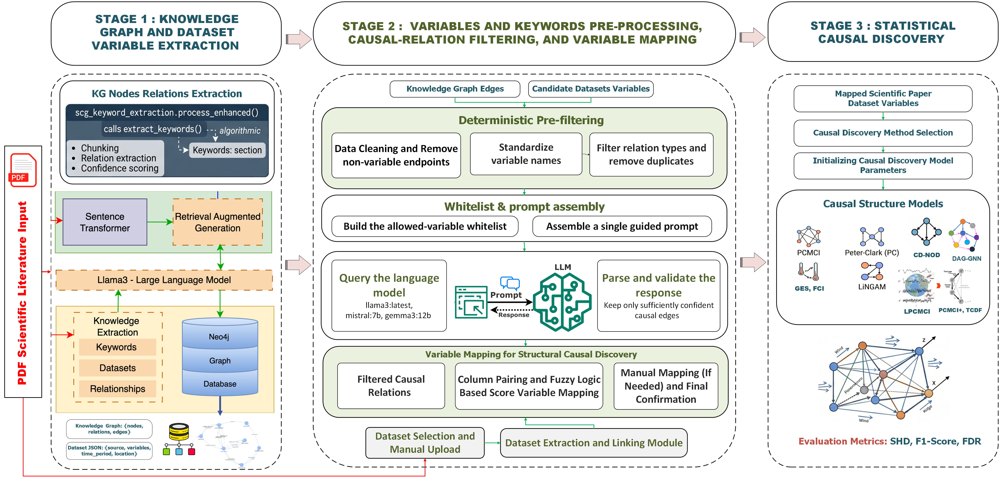
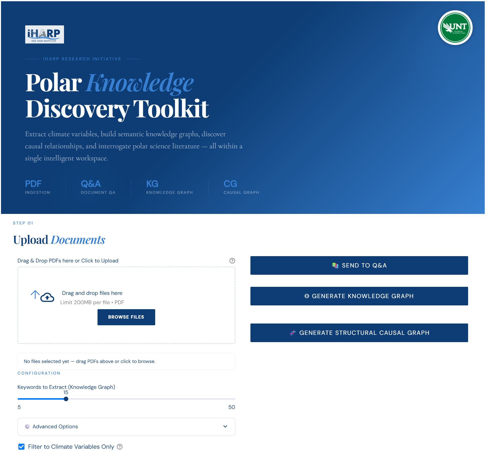
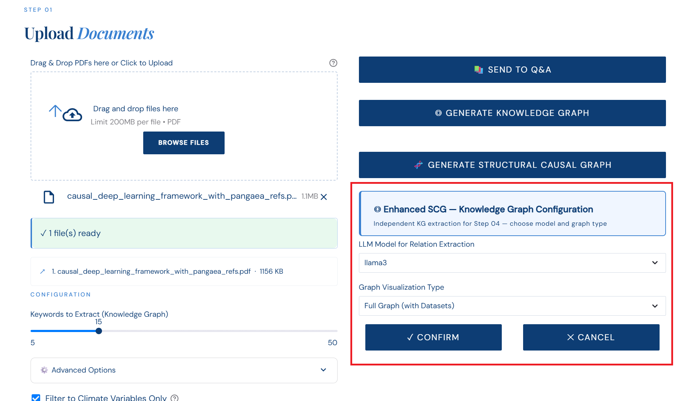
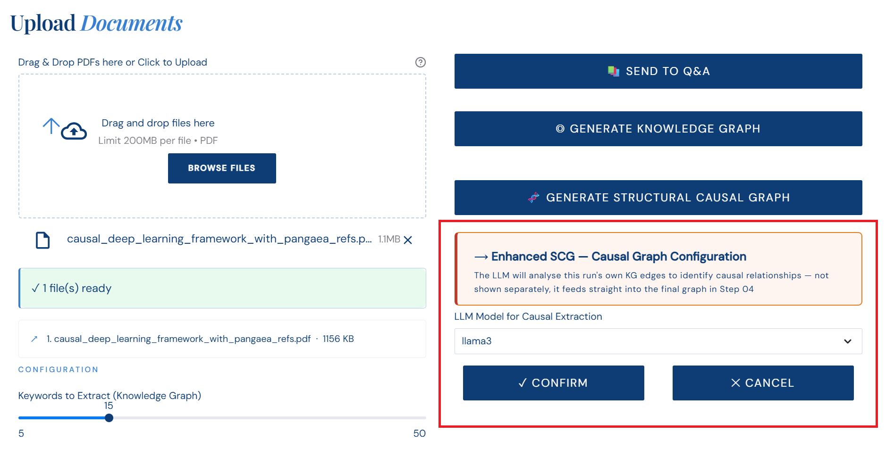
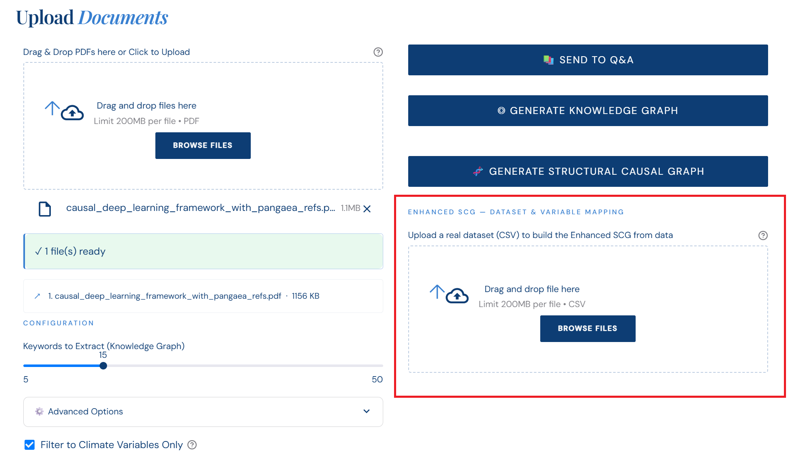
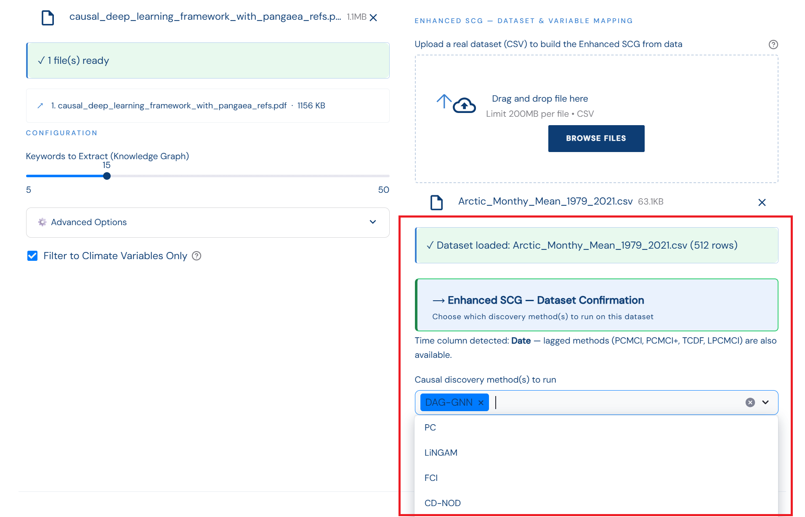
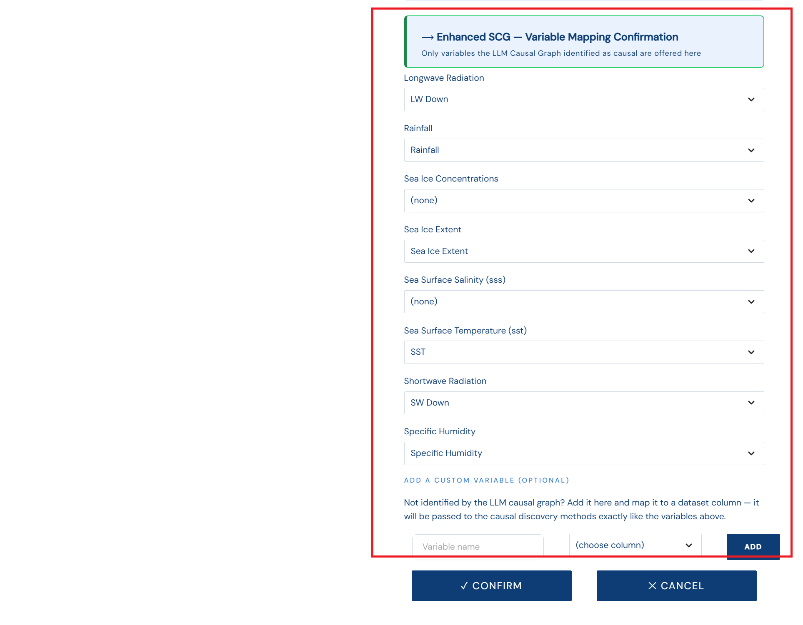
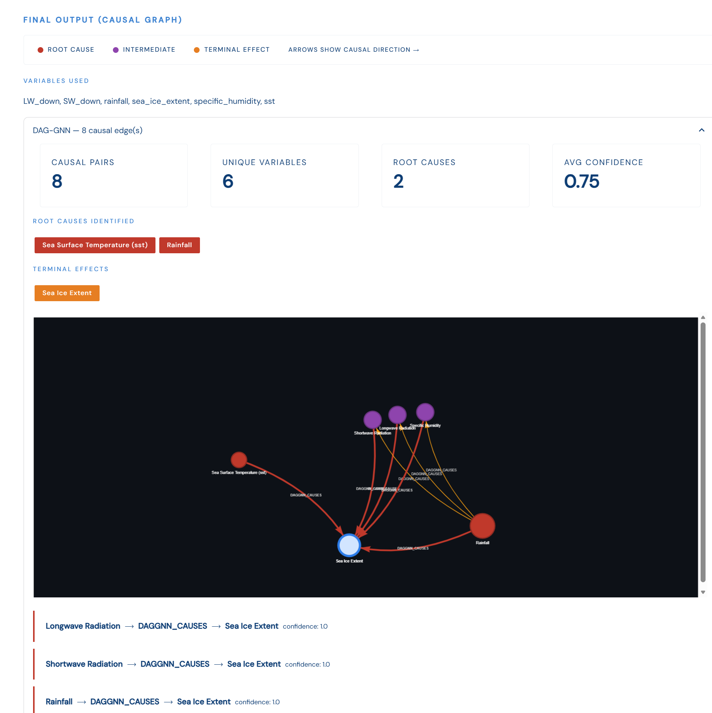

# PolarKD: LLM-based Causal Discovery from Scientific Literature

Knowledge graphs built from scientific literature capture how concepts are *related*, but their edges are semantic, not causal. This toolkit transforms literature-derived knowledge graphs into causally meaningful structures: an LLM filters knowledge-graph nodes down to a vetted set of candidate causal variables, and a suite of ten statistical causal-discovery methods, applied to real observational data from the same domain, independently recovers the causal structure among them.

Built with Streamlit, Neo4j, Ollama, causal-learn, tigramite, lingam, and PyTorch.

## Table of Contents

- [Overview](#overview)
- [Features](#features)
- [Tech Stack](#tech-stack)
- [Setup Instructions](#setup-instructions)
  - [1. Clone the Repository](#1-clone-the-repository)
  - [2. Create a Virtual Environment](#2-create-a-virtual-environment)
  - [3. Install Dependencies](#3-install-dependencies)
  - [4. Configure Environment Variables](#4-configure-environment-variables)
  - [5. Install and Run Ollama](#5-install-and-run-ollama)
  - [6. Setup Neo4j Aura](#6-setup-neo4j-aura)
  - [7. Run the Streamlit App](#7-run-the-streamlit-app)
- [Project Folder Structure](#project-folder-structure)
- [How It Works](#how-it-works)
- [The Ten Causal-Discovery Methods](#the-ten-causal-discovery-methods)
- [Results](#results)
- [Key Components](#key-components)
- [Example Workflow](#example-workflow)
- [Citation](#citation)
- [Authors](#authors)
- [Acknowledgments](#acknowledgments)
- [Future Enhancements](#future-enhancements)
- [Final Notes](#final-notes)

---

## Overview

Knowledge graphs (KGs) built from scientific literature capture how concepts are related, but their edges are semantic rather than causal, and large language models (LLMs) asked to extract causal relations from text may conflate correlation with causation or propose unsupported directions. We present a framework that transforms literature-derived KGs into causally meaningful structures. An LLM filters KG nodes to identify candidate causal variables, while statistical causal discovery (SCD), applied to observational datasets from the same domain, independently recovers the causal structure among them. Building on the existing KG pipeline, our toolkit integrates ten causal-discovery methods across independent and identically distributed (i.i.d.) and time-series regimes, including latent-confounder-aware algorithms. 


*Overview of the proposed framework.*


*The toolkit's landing view — PDF ingestion, Q&A, Knowledge Graph, and Causal Graph in a single workspace.*

---

## Features

### Causal Discovery Engine

- LLM-based causal-variable filtering: a closed-whitelist prompt with explicit correlation-vs-causation instructions, applied to KG edges plus dataset-described variables
- Two-pass validation: hallucination rejection (only whitelist-verbatim names accepted), self-loop removal, low-confidence pruning, plus an independent embedding-based confidence score to complement the LLM's own self-reported (often-inflated) confidence
- Automated variable-to-dataset-column mapping via a curated abbreviation dictionary + guarded fuzzy matching, with user confirmation before anything runs
- Ten integrated causal-discovery methods across five families: constraint-based, functional, score-based, gradient-based, and time-series (including latent-confounder-aware methods) auto-gated by whether the uploaded dataset has a time column
- Interactive PyVis causal graphs: root-cause / intermediate / terminal-effect coloring, confidence-weighted edges, per-method result panels, CSV export

### Knowledge Graph Foundation

- Upload single or multiple PDFs; hybrid keyword extraction (declared Keywords: section, else TF-IDF/YAKE/KeyBERT)
- Chunk-wise LLM relation extraction (Ollama) stored in Neo4j
- Optional GPT-4o-mini dataset-reference extraction with PRIMARY/CITED classification
- Climate/domain variable filtering to keep the graph focused on measurable quantities
- Interactive hub-based Knowledge Graph visualization (PyVis)

### Document Q&A

- Retrieval-Augmented Generation over indexed PDFs, served through the same local Ollama models

### Privacy and Performance

- All LLM calls (relation extraction, causal filtering, Q&A) run locally through Ollama — no data leaves the machine
- GPT-4o-mini dataset extraction is optional and explicitly opt-in
- Causal-learn/tigramite/lingam/torch are imported lazily per method, so a missing or broken package disables only that one method

---

## Tech Stack

- Python 3.10+
- Streamlit (frontend)
- pdfplumber, NLTK, spaCy (text extraction/cleaning)
- TF-IDF, YAKE, KeyBERT (keyword extraction)
- Ollama — `llama3:latest`, `mistral:7b`, `gemma3:12b`
- OpenAI GPT-4o-mini (optional dataset extraction)
- Neo4j (knowledge graph storage)
- PyVis (interactive graph visualization)
- Sentence-Transformers (embedding-based confidence scoring, RAG)
- **causal-learn** — PC, FCI, CD-NOD, GES
- **lingam** — DirectLiNGAM
- **tigramite** — PCMCI, PCMCI+, LPCMCI
- **PyTorch** — DAG-GNN, TCDF
- fuzzywuzzy, wordninja (variable-name matching and cleanup)
- python-dotenv

---

## Setup Instructions

### 1. Clone the Repository
```bash
git clone https://github.com/d3lab-unt/polarKD.git
cd "polarKD/PolarDS 2026"
```

### 2. Create a Virtual Environment
```bash
python3 -m venv venv
source venv/bin/activate  # On Windows: venv\Scripts\activate
```

### 3. Install Dependencies
```bash
pip install -r requirements.txt
```

### 4. Configure Environment Variables

Create a `.env` file inside the `config/` directory at the repo root:

```bash
# OpenAI API Configuration (optional — only needed for GPT-4 dataset extraction)
OPENAI_API_KEY=your_openai_api_key_here

# Neo4j Aura Configuration
NEO4J_URI=neo4j+s://your-instance-id.databases.neo4j.io
NEO4J_USER=neo4j
NEO4J_PASSWORD=your_neo4j_password_here
NEO4J_DATABASE=neo4j
```

If `OPENAI_API_KEY` is not provided, the system simply skips GPT-4 dataset extraction.

### 5. Install and Run Ollama

```bash
ollama pull llama3:latest
ollama pull mistral:7b
ollama pull gemma3:12b

ollama serve
```

### 6. Setup Neo4j Aura

1. Create a free Neo4j Aura instance at https://console.neo4j.io
2. Wait ~60 seconds for the instance to become available
3. Copy the connection credentials from the Python driver section
4. Add them to `config/.env`

### 7. Run the Streamlit App

```bash
cd Frontend/Code
streamlit run frontend_light_cg.py --server.address localhost --server.port 8501
```

---

## Project Folder Structure

```bash
PolarDS 2026/
├── requirements.txt          # Single dependency file for the whole repo
├── config/
│   └── .env                    # Neo4j + OpenAI credentials (see above)
├── Knowledge_graph/          # PDF -> keyword/relation extraction -> Neo4j -> Q&A
│   └── Code/
├── Causal_graph/             # Causal-relation extraction + the 10-method discovery engine
│   └── Code/
│       ├── causal_graph.py
│       ├── causal_discovery.py
│       ├── scg_keyword_extraction.py
│       └── cg_evaluations/       # Benchmark notebooks + synthetic/Sachs ground truth
└── Frontend/                 # The Streamlit application
    └── Code/
        └── frontend_light_cg.py
```

## How It Works

### Step 1: Knowledge Graph Extraction

The workflow begins by extracting a Knowledge Graph (KG) from the selected scientific literature. The system processes the uploaded papers, identifies relevant entities and relationships, and stores the extracted information as a structured graph. Dataset descriptions and their reported variables are also collected as an additional source of candidate variables for downstream causal analysis. This stages used the polarKD pipeline.

<p align="center">
  
</p>

---

### Step 2: Causal Variable Extraction

The extracted KG relations and dataset variables are processed to identify candidate causal variables and relationships. A deterministic pre-filter first removes noisy, non-variable, and duplicate terms. The remaining variables are then provided to the LLM through a whitelist-constrained prompt that evaluates whether each proposed relation has a plausible physical or environmental causal mechanism.

Relations containing hallucinated variables, self-loops, or low-confidence predictions are removed before the selected causal variables are passed to the next stage.

<p align="center">
  
</p>

---

### Step 3: Dataset Integration

The user uploads an observational dataset in CSV format containing measurements corresponding to the selected causal variables. The dataset provides the empirical evidence required for statistical causal discovery.

The system automatically inspects the uploaded data and determines whether a valid temporal column is available, which is later used to select between i.i.d. and time-series causal discovery methods.

<p align="center">
  
</p>

---

### Step 4: Select Causal Discovery Models

After confirming the uploading datasets, the user selects one or more statistical causal discovery methods to generate statistical causal discovery based on that datasets.

For non-temporal or i.i.d. data, the framework supports:

- PC
- FCI
- CD-NOD
- LiNGAM
- GES
- DAG-GNN

For datasets containing a valid time column, the framework additionally supports:

- PCMCI
- PCMCI+
- TCDF
- LPCMCI

The LLM determines the literature-grounded variable scope, while these causal discovery algorithms infer relationships independently from the observational data.

<p align="center">
  
</p>

---

### Step 5: Variable Mapping

The literature-derived causal variables are aligned with columns in the uploaded dataset. The system first uses curated abbreviation and naming rules and then applies guarded fuzzy matching when necessary.

Each literature variable is mapped to at most one dataset column. The proposed mappings are displayed to the user for confirmation or manual correction before causal discovery is performed.

<p align="center">
  
</p>
---

### Step 6: Final Causal Graph

The selected causal discovery method is executed on the confirmed dataset variables to estimate the final causal structure. The resulting interface summarizes the number of detected causal relationships, unique variables, root causes, and terminal effects.

The final Structural Causal Graph can then be visualized and compared across different causal discovery algorithms.

<p align="center">
  
</p>

---

## The Ten Causal-Discovery Methods

| Method | Family | Data | Notes |
|---|---|---|---|
| PC | Constraint-based | i.i.d. | Only fully-oriented edges kept; undirected pairs dropped rather than guessed |
| FCI | Constraint-based | i.i.d. | Tolerates unmeasured confounders via bidirected marks |
| CD-NOD | Constraint-based | i.i.d. | Flags variables whose mechanism appears nonstationary |
| LiNGAM | Functional | i.i.d. | DirectLiNGAM — fully orients every edge via a non-Gaussian-noise assumption |
| GES | Score-based | i.i.d. | Greedy Equivalence Search, maximizes a global BIC score |
| DAG-GNN | Gradient-based | i.i.d. | Augmented-Lagrangian, acyclicity-constrained autoencoder |
| PCMCI | Constraint-based | Time series | Lagged links only; FDR (Benjamini-Hochberg) corrected |
| PCMCI+ | Constraint-based | Time series | PCMCI + contemporaneous (lag-0) links |
| TCDF | Neural | Time series | Depthwise dilated-causal CNN + attention + permutation-importance validation |
| LPCMCI | Constraint-based | Time series | Latent-confounder-aware — the time-series counterpart to FCI |

Full academic citations, algorithm explanations, and hyperparameter justifications for every method live directly in `Causal_graph/Code/causal_discovery.py`'s own Algorithm Glossary and per-method docstrings,  the code is self-documenting.

---

## Causal Discovery Methods Validation

Evaluated on two synthetic benchmarks with known ground-truth causal structure (an 8-variable i.i.d. SEM, 12 true edges; a 4-variable nonstationary time series with contemporaneous and lagged dependencies), scored by Structural Hamming Distance (SHD), F1, and False Discovery Rate (FDR):

| Metric | PC | FCI¹ | CD-NOD | LiNGAM | DAG-GNN | GES | PCMCI | PCMCI+ | TCDF | LPCMCI¹ |
|---|---|---|---|---|---|---|---|---|---|---|
| SHD ↓ | 2 | 2 | 2 | 0 | 0 | 2 | 0 | 0 | 0 | 1 |
| F1 ↑ | 0.909 | 0.909 | 0.909 | 1.000 | 1.000 | 0.909 | 1.000 | 1.000 | 1.000 | 0.889 |
| FDR ↓ | 0.000 | 0.000 | 0.000 | 0.000 | 0.000 | 0.000 | 0.000 | 0.000 | 0.000 | 0.200 |

¹ SHD and F1 computed on the adjacency skeleton for FCI and LPCMCI, whose bidirected marks are a deliberate "cannot orient this edge" statement, not a miss.

LiNGAM and DAG-GNN recover the full i.i.d. ground truth exactly; PCMCI, PCMCI+, and TCDF recover the time-series summary graph exactly. The full pipeline was also validated end-to-end on a real polar-science publication: from a single uploaded PDF, the system extracts a knowledge graph, identifies LLM-vetted causal variables, maps them to a user-provided dataset from the same study, detects the time column to select appropriate methods, and produces an interpretable causal graph for visualization and export.

---

## Key Components

### `Causal_graph/Code/causal_graph.py` — LLM Causal-Relation Extraction

- `extract_causal_relations()` — the 3-layer filtering pipeline (deterministic pre-filter, whitelist-constrained LLM pass with automatic retry on empty parses, post-validation) described above
- `run_causal_discovery()` — orchestrates the ten `causal_discovery.py` method calls and maps their output back to KG-node space
- `generate_causal_graph()` — PyVis rendering with root-cause/intermediate/terminal-effect coloring and confidence-weighted edge styling

### `Causal_graph/Code/causal_discovery.py` — The Discovery Engine

Ten `run_*()` method implementations plus shared utilities: dataset loading, time-column detection, and `suggest_variable_mapping()` (the abbreviation-dictionary + fuzzy-matching variable-to-column aligner). Every method is lazily imported inside its own function, so a missing dependency disables only that one method. See [The Ten Causal-Discovery Methods](#the-ten-causal-discovery-methods) above.

### `Causal_graph/Code/scg_keyword_extraction.py` — Enhanced Keyword Extraction

`process_enhanced()` widens keyword extraction to also catch variables mentioned only in a paper's body text (not just a declared Keywords: section); `extract_dataset_variables()` surfaces dataset-only variables as extra causal-filtering candidates even when they never earned a KG edge of their own.

### `Knowledge_graph/Code/keywords_extraction.py` — Knowledge Graph Extraction

Hybrid keyword extraction (declared section vs. TF-IDF/YAKE/KeyBERT fallback), chunk-wise LLM relation extraction, and optional GPT-4o-mini dataset-reference extraction with PRIMARY/CITED classification, feeding Neo4j storage.

### `Frontend/Code/frontend_light_cg.py` — The Streamlit Interface

Four steps in one app: Upload, Document Q&A, Knowledge Graph, and Causal Graph — the last being a self-contained pipeline with its own `scg_`-prefixed session state, fully independent of the first three. Full step-by-step execution flow and design decisions are documented in `info.txt`.

---

## Example Workflow

Upload a PDF → Generate Knowledge Graph → Generate Structural Causal Graph → LLM filters KG edges into vetted causal variables → upload a dataset from the same study → select causal-discovery methods →  confirm variable-to-column mapping → view the interactive causal graph → export as CSV.

---

## Citation

If you use this toolkit, please cite:

> Khawja Imran Masud, Aeshwa Kachhadiya, Sharad Sharma, and Sahara Ali. 2026. LLM-based Causal Discovery from Scientific Literature.

Code: https://github.com/d3lab-unt/polarKD/tree/main/PolarDS%202026

---

## Authors

**Khawja Imran Masud**, **Aeshwa Kachhadiya**, **Sharad Sharma**, **Sahara Ali**
Data-Driven Decision (D3) Lab, University of North Texas

This work builds on the **PolarKD** knowledge-graph extraction pipeline (Ajith Kumar Dugyala, Harini Varanasi, and Sahara Ali, *LLM-Enhanced Knowledge Discovery for Polar Data Science*, PolDS '25), which the `Knowledge_graph/` foundation of this repo is based on.

---

## Acknowledgments

This work is supported by NSF grant HDR Institute: Harnessing Data and Model Revolution in the Polar Regions (HARP) (OAC-2118285). All experiments were conducted in the Data-Driven Decision (D3) Lab at the University of North Texas.

---

## Final Notes

All causal-relation extraction, knowledge-graph construction, and question answering are performed locally through Ollama, ensuring that no data leave the user’s machine unless GPT-4-based dataset extraction is explicitly enabled. The literature-derived and data-driven components are independently verifiable: the LLM determines the relevant variable scope, while statistical causal discovery infers relationships from observational data. We evaluate the causal discovery stage against known ground-truth structures on two synthetic benchmarks and further demonstrate the complete pipeline end-to-end using real polar-science literature and associated datasets.
